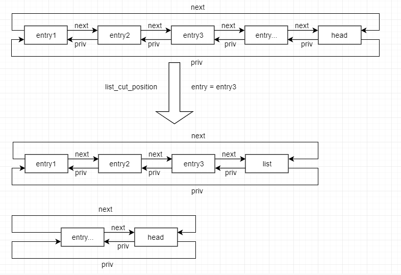
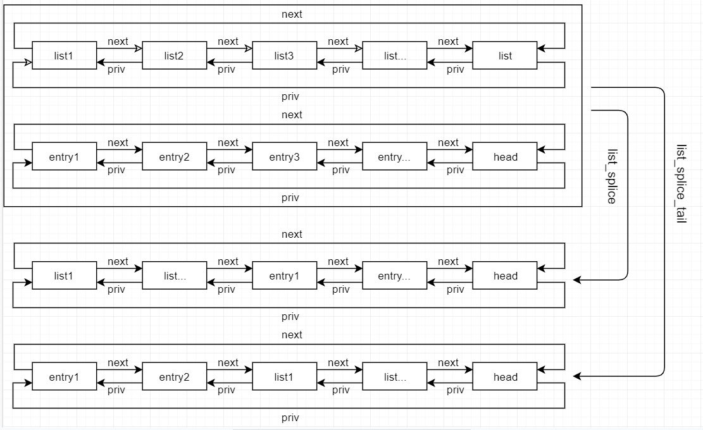

# The Linux Kernel API

## 1. List Management Functions

```
1.1 void INIT_LIST_HEAD(struct list_head *list)

Desc: 初始化 list 指向自己

1.2 #define LIST_HEAD_INIT(name) {&(name), &{name}}

Desc: 初始化name 指向自己

2 #define LIST_HEAD(name)

Desc: 定义并初始化名为name的 list_head 变量

3.1 void list_add(struct list_head *new, struct list_head *head)
Desc: 添加new 到 head 后面

3.2 void list_add_tail(struct list_head *new, struct list_head *head)
Desc: 添加new 到 head 前面

```

list_add 和 list_add_tail


```
4.1 void list_del(struct list_head *entry)
Desc: 从 list 删除 entry

4.2 void list_del_init(struct list_head *entry)
Desc: 从 list 删除 entry, 病初始化 entry

5.1 void list_replace(strut list_head *old, struct list_head *new)
Desc：用 new 替换 list 中的 old

5.2 void list_replace_init(struct list_head *old, struct list_head *new)
Desc: 用 new 替换 list 中的 old, 并初始化old

6.1 voud list_move(struct list_head *list, struct list_head *head)
Desc: 从一个链表删除，后 insert to after head

6.2 void list_move_tail(struct list_head *list, struct list_head *head)
Desc: 从一个链表删除， 后 insert to before head 

7 int list_is_last(const struct list_head *list, const struct list_head *head)
Desc: check list 是否是 head 中最后一个节点

8.1 int list_empty(struct list_head *head)
Desc: check head 链表是否为空

8.2 int list_empty_careful(struct list_head *head)
Desc: check head 链表是否为空

9 void list_rotate_left(struct list_head *list, struct list_head *head)
Desc: move list to before head

10 int list_is_singular(const struct list_head *head)
Desc: check head 是否只有一个 entry

11 void list_cut_position(struct list_head *list, struct list_head *head, struct list_head *enry)
Desc: 用 entry 将 head 切成两个链表

```

list_cut_position:



```
12.1 void list_splice(const struct list_head *list, const struct list_head *head)
Desc: join list into head after head

12.2 void list_splice_tail(const list_head *list, const struct list_head *head)
Desc: join list into head before head

12.3 void list_splice_init(const list_head *list, const struct list_head *head)
12.4 void list_splice_tail_init(const list_head *list, const struct list_head *head)
Desc: 重新初始化 list
```

list_splice and list_splice_tail



```
13.1 #define list_entry(ptr, type, member) \
   container_of(ptr, type, member)
Desc: 根据 struct list_head 得到包含该成员的变量

13.2 #define list_first_entry(ptr, type, member) \
     container_of((ptr)->next, type, member)
Desc: 根据第一个 struct list_head 得到包含该成员的变量

13.3 #define list_last_entry(ptr, type, member) \
     container_of((ptr)->priv, type, member)
Desc: 根据最后一个 struct list_head 得到包含该成员的变量

13.4 #define list_first_entry_or_null(ptr, type, member) \
Desc: 如果第一个 list 为空，返回 NULL

13.5 #efine list_next_entry(pos, member) \
     list_entry((pos)->member.next, typeof(*(pos)), member)
Desc: 根据 entry 获取下一个entry

13.6 #efine list_priv_entry(pos, member) \
     list_entry((pos)->member.priv, typeof(*(pos)), member)
Desc: 根据 entry 获取前一个entry

14.1 #define list_for_each(pos, head) \
     for(pos=(head)->next; pos!=head; pos=pos->next)
Desc: 遍历 head list(next)

14.2 #define list_for_each_prev(pos, head) \
     for(pos=(head)->prev; pos!=(head); pos=pos->prev)
Desc: 遍历 head list(prev)

14.3 #define list_for_each_safe(pos, n, head) \
     for (pos=(head)->nex, n=pos->next; pos=!(head); pos=n, n=pos->next)
Desc: 遍历 head list(next)

14.4 #define list_for_each_prev_safe(pos, n, head) \
      for (pos=(head)->prev, n=pos->prev; pos!=(head); pos=n, n=pos->prev)
Desc: 遍历 head list(prev)

15.1 #define list_for_entry(pos, head, member) \
      for (pos=list_first_entry(head, typeof(*pos), member)); \
           &pos->member!=(head); \
            pos=list_next_entry(pos, member))
Desc: 遍历 entry(next)

15.2 #define list_for_each_entry_reverse(pos, head, member) \
      for (pos=list_last_entry(head, typeof(*pos*), member); \
           &pos->member!=(head); \
            pos=list_prev_entry(pos, member))
Desc: 遍历 entry(prev)

15.3 #define list_prepare_entry(pos, head, member) \
      ((pos) ? : list_entry(head, typeof(*pos), member))
Desc: 为 list_for_each_entry_continue() 提供 entry

15.4 #define list_for_each_entry_continue(pos, head, member) \
     for (pos=list_next_entry(pos, member); \
          &pos->member != (head); \
           pos=list_next_entry(pos, member))
Desc: 从 pos 下一点 遍历

15.5 #define list_for_each_entry_continue_reverse(pos, head, member) \
     for (pos=list_prev_entry(pos, member); \
          &pos->member != (head); \
           pos=list_prev_entry(pos, member))
Desc: 从 pos 前一点 反向遍历

15.6 #define list_for_each_entry_from(pos, head, member) \
      for (; &pos->member!=(head); \
           pos=list_next_entry(pos, member))
Desc: 从当前点遍历

15.7 #define list_for_each_entry_from_reverse(pos, head, member) \
      for (; &pos->member!=(head); \
           pos=list_prev_entry(pos, member))
Desc: 从当前点遍历

15.8 #define list_for_each_entry_safe(pos, head, member)
Desc: 遍历 entry 时， 可以删除当前entry

15.9 #define list_safe_reset_next(pos, n, member) \
      n=list_next_entry(pos, member)
```

## 2. C Library func

### 2.1 string conversions

```
1.1 unsigned long long simple_strtoull(const char* cp, char **endp, unsigned int base)
Desc: 转换 string to uul

1.2 unsigned long simple_strtol(const char* cp, char** endp, unsigned int base)
Desc: 转换 string to ul

1.3 long long simple_tol(const char* cp, char** endp, unsigned int base)
Desc: 转换 string to l

1.4 long long simple_toll(const char* cp, char** endp, unsigned int base)
Desc: 转换 string to ll

1.5 int kstrtol(const char* s, unsigned int base, long *res)
Desc: convert string to l

1.6 int kstrtoul(const char* s, unsigned int base, unsigned long *res)
Desc: convert string to ul

1.7 int kstrtoull(const char* s, unsigned int base, unsigned long long*res)
Desc: convert string to ull

1.8 int kstrtoll(const char* s, unsigned int base, long long *res)
Desc: convert string to ll

1.9 int kstrtouint(const char* s, unsigned int base, unsigned int *res)
Desc: convert string to unsigned int

1.10 int kstrtoint(const char* s, unsigned int base, int *res)
Desc: convert string to int

1.11 int kstrtobool(const char* s, unsigned int base, boot *res)
Desc: convert string to bool

```

### 2.2 string Manipulation

```
1. strncasecmp(const char* s1, const char* s2, size_t len)
Desc: 不区分大小，指定长度比较

2.1 strlcpy()

2.2 strscpy()

3.1 strchr(const char *s, int c)
Desc: 在 s 中查找第一个c出现的位置

3.2 strrchr(const char *s, int c)
Desc: 在 s 中查找最后一次出现c 的位置

3.3 strnchr(const char *s, size_t count, int c)
Desc: 指定长度查找c

4. char* skip_space(const char *str)
Desc: 返回str 中第一个非空格字符指针

5.1 strlen(const char* s)
5.2 strnlen(const char *s, size_t count)
Desc: strnlen 可以防止strlen 中 s 不是以NULL结束的错误

6.1 size_t strspn(const char *s, const char * accept)
Desc: 计算s 开头包含accept 中字符的个数

6.2 size_t strcspn(const char *s, const char *reject) 
Desc: 计算s 开头不包含reject 中字符的个数

7. char * strpbrk(const char *cs, const char *ct)
Desc: 查找ct 中任意字符第一次在cs出现的位置

8. char * strsep(const char** s, const char* ct)
Desc: 
```
