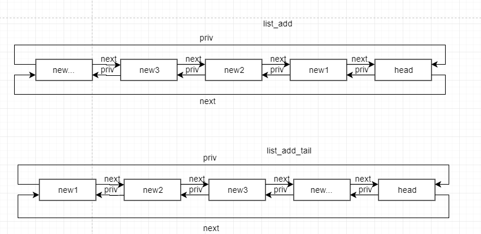

# The Linux Kernel API

## 1. List Management Functions

```
1.1 void INIT_LIST_HEAD(struct list_head *list)

Desc: 初始化 list 指向自己

1.2 #define LIST_HEAD_INIT(name) {&(name), &{name}}

Desc: 初始化name 指向自己

2 #define LIST_HEAD(name)

Desc: 定义并初始化名为name的 list_head 变量

3.1 void list_add(struct list_head *new, struct list_head *head)
Desc: 添加new 到 head 后面

3.2 void list_add_tail(struct list_head *new, struct list_head *head)
Desc: 添加new 到 head 前面

```

list_add 和 list_add_tail



```
4.1 void list_del(struct list_head *entry)
Desc: 从 list 删除 entry

4.2 void list_del_init(struct list_head *entry)
Desc: 从 list 删除 entry, 病初始化 entry

5.1 void list_replace(strut list_head *old, struct list_head *new)
Desc：用 new 替换 list 中的 old

5.2 void list_replace_init(struct list_head *old, struct list_head *new)
Desc: 用 new 替换 list 中的 old, 并初始化old

6.1 voud list_move(struct list_head *list, struct list_head *head)
Desc: 从一个链表删除，后 insert to after head

6.2 void list_move_tail(struct list_head *list, struct list_head *head)
Desc: 从一个链表删除， 后 insert to before head 

7 int list_is_last(const struct list_head *list, const struct list_head *head)
Desc: check list 是否是 head 中最后一个节点

8.1 int list_empty(struct list_head *head)
Desc: check head 链表是否为空

8.2 int list_empty_careful(struct list_head *head)
Desc: check head 链表是否为空

9 void list_rotate_left(struct list_head *list, struct list_head *head)
Desc: move list to before head

10 int list_is_singular(const struct list_head *head)
Desc: check head 是否只有一个 entry

11 void list_cut_position(struct list_head *list, struct list_head *head, struct list_head *enry)
Desc: 用 entry 将 head 切成两个链表

```

list_cut_position:


```
12.1 void list_splice(const struct list_head *list, const struct list_head *head)
Desc: join list into head after head

12.2 void list_splice_tail(const list_head *list, const struct list_head *head)
Desc: join list into head before head

12.3 void list_splice_init(const list_head *list, const struct list_head *head)
12.4 void list_splice_tail_init(const list_head *list, const struct list_head *head)
Desc: 重新初始化 list
```

list_splice and list_splice_tail


```
13.1 #define list_entry(ptr, type, member) \
   container_of(ptr, type, member)
Desc: 根据 struct list_head 得到包含该成员的变量

13.2 #define list_first_entry(ptr, type, member) \
     container_of((ptr)->next, type, member)
Desc: 根据第一个 struct list_head 得到包含该成员的变量

13.3 #define list_last_entry(ptr, type, member) \
     container_of((ptr)->priv, type, member)
Desc: 根据最后一个 struct list_head 得到包含该成员的变量

13.4 #define list_first_entry_or_null(ptr, type, member) \
Desc: 如果第一个 list 为空，返回 NULL

13.5 #efine list_next_entry(pos, member) \
     list_entry((pos)->member.next, typeof(*(pos)), member)
Desc: 根据 entry 获取下一个entry

13.6 #efine list_priv_entry(pos, member) \
     list_entry((pos)->member.priv, typeof(*(pos)), member)
Desc: 根据 entry 获取前一个entry

14.1 #define list_for_each(pos, head) \
     for(pos=(head)->next; pos!=head; pos=pos->next)
Desc: 遍历 head list(next)

14.2 #define list_for_each_prev(pos, head) \
     for(pos=(head)->prev; pos!=(head); pos=pos->prev)
Desc: 遍历 head list(prev)

14.3 #define list_for_each_safe(pos, n, head) \
     for (pos=(head)->nex, n=pos->next; pos=!(head); pos=n, n=pos->next)
Desc: 遍历 head list(next)

14.4 #define list_for_each_prev_safe(pos, n, head) \
      for (pos=(head)->prev, n=pos->prev; pos!=(head); pos=n, n=pos->prev)
Desc: 遍历 head list(prev)

15.1 #define list_for_entry(pos, head, member) \
      for (pos=list_first_entry(head, typeof(*pos), member)); \
           &pos->member!=(head); \
            pos=list_next_entry(pos, member))
Desc: 遍历 entry(next)

15.2 #define list_for_each_entry_reverse(pos, head, member) \
      for (pos=list_last_entry(head, typeof(*pos*), member); \
           &pos->member!=(head); \
            pos=list_prev_entry(pos, member))
Desc: 遍历 entry(prev)

15.3 #define list_prepare_entry(pos, head, member) \
      ((pos) ? : list_entry(head, typeof(*pos), member))
Desc: 为 list_for_each_entry_continue() 提供 entry

15.4 #define list_for_each_entry_continue(pos, head, member) \
     for (pos=list_next_entry(pos, member); \
          &pos->member != (head); \
           pos=list_next_entry(pos, member))
Desc: 从 pos 下一点 遍历

15.5 #define list_for_each_entry_continue_reverse(pos, head, member) \
     for (pos=list_prev_entry(pos, member); \
          &pos->member != (head); \
           pos=list_prev_entry(pos, member))
Desc: 从 pos 前一点 反向遍历

15.6 #define list_for_each_entry_from(pos, head, member) \
      for (; &pos->member!=(head); \
           pos=list_next_entry(pos, member))
Desc: 从当前点遍历

15.7 #define list_for_each_entry_from_reverse(pos, head, member) \
      for (; &pos->member!=(head); \
           pos=list_prev_entry(pos, member))
Desc: 从当前点遍历

15.8 #define list_for_each_entry_safe(pos, head, member)
Desc: 遍历 entry 时， 可以删除当前entry

15.9 #define list_safe_reset_next(pos, n, member) \
      n=list_next_entry(pos, member)
```

## 2. C Library func

### 2.1 string conversions

```
1.1 unsigned long long simple_strtoull(const char* cp, char **endp, unsigned int base)
Desc: 转换 string to uul

1.2 unsigned long simple_strtol(const char* cp, char** endp, unsigned int base)
Desc: 转换 string to ul

1.3 long long simple_tol(const char* cp, char** endp, unsigned int base)
Desc: 转换 string to l

1.4 long long simple_toll(const char* cp, char** endp, unsigned int base)
Desc: 转换 string to ll

1.5 int kstrtol(const char* s, unsigned int base, long *res)
Desc: convert string to l

1.6 int kstrtoul(const char* s, unsigned int base, unsigned long *res)
Desc: convert string to ul

1.7 int kstrtoull(const char* s, unsigned int base, unsigned long long*res)
Desc: convert string to ull

1.8 int kstrtoll(const char* s, unsigned int base, long long *res)
Desc: convert string to ll

1.9 int kstrtouint(const char* s, unsigned int base, unsigned int *res)
Desc: convert string to unsigned int

1.10 int kstrtoint(const char* s, unsigned int base, int *res)
Desc: convert string to int

1.11 int kstrtobool(const char* s, unsigned int base, boot *res)
Desc: convert string to bool

```

### 2.2 string Manipulation

```
1. strncasecmp(const char* s1, const char* s2, size_t len)
Desc: 不区分大小，指定长度比较

2.1 strlcpy()

2.2 strscpy()

3.1 strchr(const char *s, int c)
Desc: 在 s 中查找第一个c出现的位置

3.2 strrchr(const char *s, int c)
Desc: 在 s 中查找最后一次出现c 的位置

3.3 strnchr(const char *s, size_t count, int c)
Desc: 指定长度查找c

4. char* skip_space(const char *str)
Desc: 返回str 中第一个非空格字符指针

5.1 strlen(const char* s)
5.2 strnlen(const char *s, size_t count)
Desc: strnlen 可以防止strlen 中 s 不是以NULL结束的错误

6.1 size_t strspn(const char *s, const char * accept)
Desc: 计算s 开头包含accept 中字符的个数

6.2 size_t strcspn(const char *s, const char *reject) 
Desc: 计算s 开头不包含reject 中字符的个数

7. char * strpbrk(const char *cs, const char *ct)
Desc: 查找ct 中任意字符第一次在cs出现的位置

8.1 char* strtok(char *s, const char* delim)
Desc: 用delim分割字符串, strtok 第一次会将s 中所有出现的delim字符替换为NULL, 然后通过依次调用strtok(NULL, delim) 得到各子串

8.2 char* strsep(char** s, const char* ct)
Desc: 用ct分割字符串，返回分隔符左侧子串，同时s 指向分隔符右侧子串

9. bool sysfs_streq(const char * s1, const char * s2)
Desc: 比较s1 和 s2, linux sysfs 输入以"\n", 结尾，sysfs_streq 设定 "\n" 和 "" 相等

10.1 int match_string(const char *const * array, size_t n, const char * string)
Desc: matches given string in an array, 返回 index of a string in the array if matches, or -EINVAL otherwise.

10.2 int __sysfs_match_string(const char *const * array, size_t n, const char * str)
Desc: 使用sysfs_streq 比较s1, s2

11.1 memset(void *buf, int c, size_t count)
Desc: 填充字节

11.2 memzero__explicit(void *buf, size_t count)

11.3 void * memset16(uint16_t * s, uint16_t v, size_t count)
Desc: 填充 uint16_t 数据

11.4 void * memset32(uint32_t * s, uint32_t v, size_t count)
Desc: 填充 uint32_t 数据

11.5 void * memset64(uint64_t * s, uint64_t v, size_t count)
Desc: 填充 uint64_t 数据

12.1 void * memcpy(void * dest, const void * src, size_t count)

12.2 void * memmove(void * dest, const void * src, size_t count)

12.3 __visible int memcmp(const void * cs, const void * ct, size_t count)

12.4 void * memscan(void * addr, int c, size_t size)
Desc: 

12.5 void * memchr(const void * s, int c, size_t n)
Desc: 在内存区查找字符c

12.6 void * memchr_inv(const void * start, int c, size_t bytes)
Desc: 在内存区查找第一个非C字符

13.1 char * strstr(const char * s1, const char * s2)
Desc: 在s1 中查找第一次出现s2 的位置

13.2 char * strnstr(const char * s1, const char * s2, size_t len)

13.3 char * strreplace(char * s, char old, char new)
Desc: 用new字符替换s中出现的old字符
```

### 2.3 Bit Operations

```
1.1 void set_bit(long nr, volatile unsigned long * addr)
Desc: bit 置1，原子操作

1.2 void __set_bit(long nr, volatile unsigned long * addr)
Desc: bit 置1，非原子操作

1.3 void clear_bit(long nr, volatile unsigned long * addr)
Desc: bit 清0, 原子操作

1.4 void change_bit(long nr, volatile unsigned long * addr)
Desc: bit change, 原子操作

1.5 void __change_bit(long nr, volatile unsigned long * addr)
Desc: bit change, 非原子操作

2.1 bool test_and_set_bit(long nr, volatile unsigned long * addr)
Desc: set bit 且 返回 旧值，原子操作

2.2 bool test_and_set_bit_lock(long nr, volatile unsigned long * addr)
Desc: 类似 test_and_set_bit, 用于x86

2.3 bool __test_and_set_bit(long nr, volatile unsigned long * addr)
Desc: 非原子操作

2.4 bool test_and_clear_bit(long nr, volatile unsigned long * addr)
Desc: clear bit 且 返回旧值， 原子操作

2.5 bool __test_and_clear_bit(long nr, volatile unsigned long * addr)
Desc: 非原子操作

2.6 bool test_and_change_bit(long nr, volatile unsigned long * addr)
Desc: change bit 且返回旧值， 原子操作

3. bool test_bit(int nr, const volatile unsigned long * addr)
Desc: 检查bit 是否set

4.1 unsigned long __ffs(unsigned long word)
Desc: 查找word 第一个bit 为 1 的位置

4.2 unsigned long ffz(unsigned long word)
Desc: 查找word 第一个 bit 为 0 的位置

4.3 int ffs(int x)
Desc: same as __ffs

4.4 int fls(int x)
Desc: 查找word 最后一个bit 为 1 的位

4.5 int fls64(__u64 x)

```

## 3. memory barrier


| 接口 | 作用 |
| - | - | - |
| barrier() | 优化屏障，阻止编译器为了进行性能优化而进行的memory access reorder |
| mb() | 内存屏障（包括读和写），用于SMP和UP |
| rmb()| 读内存屏障，用于SMP和UP |
| wmb()| 写内存屏障，用于SMP和UP|
| smp_mb()| 用于SMP场合的内存屏障，对于UP不存在memory order的问题（对汇编指令），因此，在UP上就是一个优化屏障，确保汇编和c代码的memory order是一致的 |
| smp_rmb() | 用于SMP场合的读内存屏障|
| smp_wmb() | 用于SMP场合的写内存屏障|  


## 4. Basic Kernel Library Functions
### 4.1 Bitmap Operations

```
1.1 void __bitmap_shift_right(unsigned long * dst, const unsigned long * src, unsigned shift, unsigned nbits)
 Desc: 将src 右移shift位，保存到dst

1.2 void __bitmap_shift_left(unsigned long * dst, const unsigned long * src, unsigned int shift, unsigned int nbits)
Desc: 将src 左移shift位，保存到dst

2. unsigned long bitmap_find_next_zero_area_off(unsigned long * map, unsigned long size, unsigned long start, unsigned int nr, unsigned long align_mask, unsigned long align_offset)
Desc: 

3.1 int __bitmap_parse(const char * buf, unsigned int buflen, int is_user, unsigned long * maskp, int nmaskbits)
Desc: convert an ASCII hex string into a bitmap.

3.2 int bitmap_parse_user(const char __user * ubuf, unsigned int ulen, unsigned long * maskp, int nmaskbits)
Desc: convert an ASCII hex string in a user buffer into a bitmap

4.1 int bitmap_print_to_pagebuf(bool list, char * buf, const unsigned long * maskp, int nmaskbits)
Desc: convert bitmap to list or hex format ASCII string

4.2 int bitmap_parselist_user(const char __user * ubuf, unsigned int ulen, unsigned long * maskp, int nmaskbits)

5.1 void bitmap_remap(unsigned long * dst, const unsigned long * src, const unsigned long * old, const unsigned long * new, unsigned int nbits)
Desc: Apply map defined by a pair of bitmaps to another bitmap 

5.2 int bitmap_bitremap(int oldbit, const unsigned long * old, const unsigned long * new, int bits)
Desc: Apply map defined by a pair of bitmaps to a single bit

5.3 void bitmap_onto(unsigned long * dst, const unsigned long * orig, const unsigned long * relmap, unsigned int bits)
Desc: translate one bitmap relative to another

6. void bitmap_fold(unsigned long * dst, const unsigned long * orig, unsigned int sz, unsigned int nbits)
Desc: fold larger bitmap into smaller, modulo specified size

7.1 int bitmap_find_free_region(unsigned long * bitmap, unsigned int bits, int order)
Desc: find a contiguous aligned mem region

7.2 void bitmap_release_region(unsigned long * bitmap, unsigned int pos, int order)
Desc: release allocated bitmap region

7.3 int bitmap_allocate_region(unsigned long * bitmap, unsigned int pos, int order)
Desc: allocate bitmap region

```