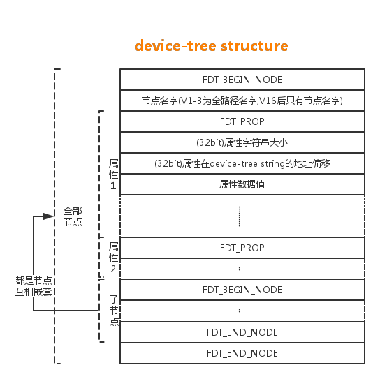
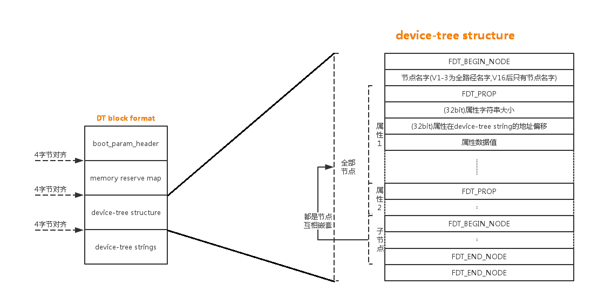

# dtb 二进制文件
- dtb 是 dts 编译后生成的二进制文件
## dtb 文件格式

boot_param_header | 
---|---
memory_reserve_map|   
device-tree structure|
device-tree strings|

### boot_param_header

```
struct boot_param_header {
        u32     magic;----------------用于标dtb文件头，等于OF_DT_HEADER=“0xd00dfeed”
        u32     totalsize;------------dtb文件大小
        u32     off_dt_struct;--------DT structure偏移
        u32     off_dt_strings;-------DT strings偏移
        u32     off_mem_rsvmap;-------memory reserve map偏移
        u32     version;--------------版本号
        u32     last_comp_version;----兼容最早版本号

        /* version 2 fields below */
        u32     boot_cpuid_phys;------physical CPU id

        /* version 3 fields below */
        u32     size_dt_strings;------size of the strings block

        /* version 17 fields below */
        u32 size_dt_struct;-----------size of the DT structure block
};
```
### memory_reserve_map
- 该段保存的是一个内存映射列表，每个列表由一段64位的物理地址和大小组成

### device-tree strings
- 该段保存了属性字符串(eg: compatible,reg,status)

### device-tree structure



```
#define FDT_MAGIC   0xd00dfeed  /* 4: version, 4: total size */
#define FDT_TAGSIZE sizeof(uint32_t)

#define FDT_BEGIN_NODE  0x1     /* Start node: full name */
#define FDT_END_NODE    0x2     /* End node */
#define FDT_PROP    0x3     /* Property: name off,
                       size, content */
#define FDT_NOP     0x4     /* nop */
#define FDT_END     0x9

#define FDT_V1_SIZE (7*sizeof(uint32_t))
#define FDT_V2_SIZE (FDT_V1_SIZE + sizeof(uint32_t))
#define FDT_V3_SIZE (FDT_V2_SIZE + sizeof(uint32_t))
#define FDT_V16_SIZE    FDT_V3_SIZE
#define FDT_V17_SIZE    (FDT_V16_SIZE + sizeof(uint32_t))
```


# 设备树加载分析(kernel version=4.4)

kernel 中 dts 解析过程如下：

```
            init/main.c
                |    
          start_kernel()
                |
          setup_arch()----setup_machine_fdt(_fdt_pointer)---elary_init_dt_scan_nodes()
                |
                |                                           |   扫描chosen结点，获取启动参数
        unflatten_device_tree()                             |----of_scan_flat_dt(early_init_dt_scan_chosen, boot_command_line);
            解析dts
                |                                                   扫描root结点
                |                                           |----of_scan_flat_dt(early_init_dt_scan_root, NULL);
__unflatten_device_tree(initial_boot_params, &of_root,
				early_init_dt_alloc_memory_arch);           |
            解析dts                                                扫描memory结点
                |                                           |----of_scan_flat_dt(early_init_dt_scan_memory, NULL);
第一次计算并分配解析生成树结构所需的空间大小，根节点保存在of_root        
unflatten_dt_node(blob, NULL, &start, NULL, NULL, 0, true); 
                |
                |
第二次真正的解析成树结构，填充结点信息，所有结点构成树，每个节点的属性构成单链表
    unflatten_dt_node(blob, mem, &start, NULL, mynodes, 0, false);
``` 
setup_arch() : /arch/*/kernel/setup.c

- driver/of/fdt.c

```
static void __init setup_machine_fdt(phys_addr_t dt_phys)
{
	void *dt_virt = fixmap_remap_fdt(dt_phys);

	if (!dt_virt || !early_init_dt_scan(dt_virt)) {
		pr_crit("\n"
			"Error: invalid device tree blob at physical address %pa (virtual address 0x%p)\n"
			"The dtb must be 8-byte aligned and must not exceed 2 MB in size\n"
			"\nPlease check your bootloader.",
			&dt_phys, dt_virt);

		while (true)
			cpu_relax();
	}

	dump_stack_set_arch_desc("%s (DT)", of_flat_dt_get_machine_name());
}

bool __init early_init_dt_scan(void *params)
{
	bool status;

	status = early_init_dt_verify(params);
	if (!status)
		return false;

	early_init_dt_scan_nodes();
	return true;
}

void __init early_init_dt_scan_nodes(void)
{
	/* Retrieve various information from the /chosen node */
	of_scan_flat_dt(early_init_dt_scan_chosen, boot_command_line);

	/* Initialize {size,address}-cells info */
	of_scan_flat_dt(early_init_dt_scan_root, NULL);

	/* Setup memory, calling early_init_dt_add_memory_arch */
	of_scan_flat_dt(early_init_dt_scan_memory, NULL);
}

/**
 * of_scan_flat_dt - scan flattened tree blob and call callback on each.
 * @it: callback function
 * @data: context data pointer
 *
 * This function is used to scan the flattened device-tree, it is
 * used to extract the memory information at boot before we can
 * unflatten the tree
 */
int __init of_scan_flat_dt(int (*it)(unsigned long node,
				     const char *uname, int depth,
				     void *data),
			   void *data)
{
	const void *blob = initial_boot_params;
	const char *pathp;
	int offset, rc = 0, depth = -1;

        for (offset = fdt_next_node(blob, -1, &depth);
             offset >= 0 && depth >= 0 && !rc;
             offset = fdt_next_node(blob, offset, &depth)) {

		pathp = fdt_get_name(blob, offset, NULL);
		if (*pathp == '/')
			pathp = kbasename(pathp);
		rc = it(offset, pathp, depth, data);
	}
	return rc;
}

int __init early_init_dt_scan_chosen(unsigned long node, const char *uname,
				     int depth, void *data)
{
	int l;
	const char *p;

	pr_debug("search \"chosen\", depth: %d, uname: %s\n", depth, uname);

	if (depth != 1 || !data ||
	    (strcmp(uname, "chosen") != 0 && strcmp(uname, "chosen@0") != 0))
		return 0;

	early_init_dt_check_for_initrd(node);

	/* Retrieve command line */
	p = of_get_flat_dt_prop(node, "bootargs", &l);
	if (p != NULL && l > 0)
		strlcpy(data, p, min((int)l, COMMAND_LINE_SIZE));

	/*
	 * CONFIG_CMDLINE is meant to be a default in case nothing else
	 * managed to set the command line, unless CONFIG_CMDLINE_FORCE
	 * is set in which case we override whatever was found earlier.
	 */
#ifdef CONFIG_CMDLINE
#ifndef CONFIG_CMDLINE_FORCE
	if (!((char *)data)[0])
#endif
		strlcpy(data, CONFIG_CMDLINE, COMMAND_LINE_SIZE);
#endif /* CONFIG_CMDLINE */

	pr_debug("Command line is: %s\n", (char*)data);

	/* break now */
	return 1;
}

/**
 * early_init_dt_scan_root - fetch the top level address and size cells
 */
int __init early_init_dt_scan_root(unsigned long node, const char *uname,
				   int depth, void *data)
{
	const __be32 *prop;

	if (depth != 0)
		return 0;

	dt_root_size_cells = OF_ROOT_NODE_SIZE_CELLS_DEFAULT;
	dt_root_addr_cells = OF_ROOT_NODE_ADDR_CELLS_DEFAULT;

	prop = of_get_flat_dt_prop(node, "#size-cells", NULL);
	if (prop)
		dt_root_size_cells = be32_to_cpup(prop);
	pr_debug("dt_root_size_cells = %x\n", dt_root_size_cells);

	prop = of_get_flat_dt_prop(node, "#address-cells", NULL);
	if (prop)
		dt_root_addr_cells = be32_to_cpup(prop);
	pr_debug("dt_root_addr_cells = %x\n", dt_root_addr_cells);

	/* break now */
	return 1;
}

/**
 * early_init_dt_scan_memory - Look for an parse memory nodes
 */
int __init early_init_dt_scan_memory(unsigned long node, const char *uname,
				     int depth, void *data)
{
	const char *type = of_get_flat_dt_prop(node, "device_type", NULL);
	const __be32 *reg, *endp;
	int l;

	/* We are scanning "memory" nodes only */
	if (type == NULL) {
		/*
		 * The longtrail doesn't have a device_type on the
		 * /memory node, so look for the node called /memory@0.
		 */
		if (!IS_ENABLED(CONFIG_PPC32) || depth != 1 || strcmp(uname, "memory@0") != 0)
			return 0;
	} else if (strcmp(type, "memory") != 0)
		return 0;

	reg = of_get_flat_dt_prop(node, "linux,usable-memory", &l);
	if (reg == NULL)
		reg = of_get_flat_dt_prop(node, "reg", &l);
	if (reg == NULL)
		return 0;

	endp = reg + (l / sizeof(__be32));

	pr_debug("memory scan node %s, reg size %d,\n", uname, l);

	while ((endp - reg) >= (dt_root_addr_cells + dt_root_size_cells)) {
		u64 base, size;

		base = dt_mem_next_cell(dt_root_addr_cells, &reg);
		size = dt_mem_next_cell(dt_root_size_cells, &reg);

		if (size == 0)
			continue;
		pr_debug(" - %llx ,  %llx\n", (unsigned long long)base,
		    (unsigned long long)size);

		early_init_dt_add_memory_arch(base, size);
	}

	return 0;
}


/**
 * unflatten_device_tree - create tree of device_nodes from flat blob
 *
 * unflattens the device-tree passed by the firmware, creating the
 * tree of struct device_node. It also fills the "name" and "type"
 * pointers of the nodes so the normal device-tree walking functions
 * can be used.
 */
void __init unflatten_device_tree(void)
{
	__unflatten_device_tree(initial_boot_params, &of_root,
				early_init_dt_alloc_memory_arch);

	/* Get pointer to "/chosen" and "/aliases" nodes for use everywhere */
	of_alias_scan(early_init_dt_alloc_memory_arch);
}

/**
 * __unflatten_device_tree - create tree of device_nodes from flat blob
 *
 * unflattens a device-tree, creating the
 * tree of struct device_node. It also fills the "name" and "type"
 * pointers of the nodes so the normal device-tree walking functions
 * can be used.
 * @blob: The blob to expand
 * @mynodes: The device_node tree created by the call
 * @dt_alloc: An allocator that provides a virtual address to memory
 * for the resulting tree
 */
static void __unflatten_device_tree(const void *blob,
			     struct device_node **mynodes,
			     void * (*dt_alloc)(u64 size, u64 align))
{
	unsigned long size;
	int start;
	void *mem;

	pr_debug(" -> unflatten_device_tree()\n");

	if (!blob) {
		pr_debug("No device tree pointer\n");
		return;
	}

	pr_debug("Unflattening device tree:\n");
	pr_debug("magic: %08x\n", fdt_magic(blob));
	pr_debug("size: %08x\n", fdt_totalsize(blob));
	pr_debug("version: %08x\n", fdt_version(blob));

	if (fdt_check_header(blob)) {
		pr_err("Invalid device tree blob header\n");
		return;
	}

	/* First pass, scan for size */
	start = 0;
	size = (unsigned long)unflatten_dt_node(blob, NULL, &start, NULL, NULL, 0, true);
	size = ALIGN(size, 4);

	pr_debug("  size is %lx, allocating...\n", size);

	/* Allocate memory for the expanded device tree */
	mem = dt_alloc(size + 4, __alignof__(struct device_node));
	memset(mem, 0, size);

	*(__be32 *)(mem + size) = cpu_to_be32(0xdeadbeef);

	pr_debug("  unflattening %p...\n", mem);

	/* Second pass, do actual unflattening */
	start = 0;
	unflatten_dt_node(blob, mem, &start, NULL, mynodes, 0, false);
	if (be32_to_cpup(mem + size) != 0xdeadbeef)
		pr_warning("End of tree marker overwritten: %08x\n",
			   be32_to_cpup(mem + size));

	pr_debug(" <- unflatten_device_tree()\n");
}

/**
 * unflatten_dt_node - Alloc and populate a device_node from the flat tree
 * @blob: The parent device tree blob
 * @mem: Memory chunk to use for allocating device nodes and properties
 * @poffset: pointer to node in flat tree
 * @dad: Parent struct device_node
 * @nodepp: The device_node tree created by the call
 * @fpsize: Size of the node path up at the current depth.
 * @dryrun: If true, do not allocate device nodes but still calculate needed
 * memory size
 */
static void * unflatten_dt_node(const void *blob,
				void *mem,
				int *poffset,
				struct device_node *dad,
				struct device_node **nodepp,
				unsigned long fpsize,
				bool dryrun)
{
	const __be32 *p;
	struct device_node *np;
	struct property *pp, **prev_pp = NULL;
	const char *pathp;
	unsigned int l, allocl;
	static int depth;
	int old_depth;
	int offset;
	int has_name = 0;
	int new_format = 0;

	pathp = fdt_get_name(blob, *poffset, &l);
	if (!pathp)
		return mem;

	allocl = ++l;

	/* version 0x10 has a more compact unit name here instead of the full
	 * path. we accumulate the full path size using "fpsize", we'll rebuild
	 * it later. We detect this because the first character of the name is
	 * not '/'.
	 */
	if ((*pathp) != '/') {
		new_format = 1;
		if (fpsize == 0) {
			/* root node: special case. fpsize accounts for path
			 * plus terminating zero. root node only has '/', so
			 * fpsize should be 2, but we want to avoid the first
			 * level nodes to have two '/' so we use fpsize 1 here
			 */
			fpsize = 1;
			allocl = 2;
			l = 1;
			pathp = "";
		} else {
			/* account for '/' and path size minus terminal 0
			 * already in 'l'
			 */
			fpsize += l;
			allocl = fpsize;
		}
	}

	np = unflatten_dt_alloc(&mem, sizeof(struct device_node) + allocl,
				__alignof__(struct device_node));
	if (!dryrun) {
		char *fn;
		of_node_init(np);
		np->full_name = fn = ((char *)np) + sizeof(*np);
		if (new_format) {
			/* rebuild full path for new format */
			if (dad && dad->parent) {
				strcpy(fn, dad->full_name);
#ifdef DEBUG
				if ((strlen(fn) + l + 1) != allocl) {
					pr_debug("%s: p: %d, l: %d, a: %d\n",
						pathp, (int)strlen(fn),
						l, allocl);
				}
#endif
				fn += strlen(fn);
			}
			*(fn++) = '/';
		}
		memcpy(fn, pathp, l);

		prev_pp = &np->properties;
		if (dad != NULL) {
			np->parent = dad;
			np->sibling = dad->child;
			dad->child = np;
		}
	}
	/* process properties */
	for (offset = fdt_first_property_offset(blob, *poffset);
	     (offset >= 0);
	     (offset = fdt_next_property_offset(blob, offset))) {
		const char *pname;
		u32 sz;

		if (!(p = fdt_getprop_by_offset(blob, offset, &pname, &sz))) {
			offset = -FDT_ERR_INTERNAL;
			break;
		}

		if (pname == NULL) {
			pr_info("Can't find property name in list !\n");
			break;
		}
		if (strcmp(pname, "name") == 0)
			has_name = 1;
		pp = unflatten_dt_alloc(&mem, sizeof(struct property),
					__alignof__(struct property));
		if (!dryrun) {
			/* We accept flattened tree phandles either in
			 * ePAPR-style "phandle" properties, or the
			 * legacy "linux,phandle" properties.  If both
			 * appear and have different values, things
			 * will get weird.  Don't do that. */
			if ((strcmp(pname, "phandle") == 0) ||
			    (strcmp(pname, "linux,phandle") == 0)) {
				if (np->phandle == 0)
					np->phandle = be32_to_cpup(p);
			}
			/* And we process the "ibm,phandle" property
			 * used in pSeries dynamic device tree
			 * stuff */
			if (strcmp(pname, "ibm,phandle") == 0)
				np->phandle = be32_to_cpup(p);
			pp->name = (char *)pname;
			pp->length = sz;
			pp->value = (__be32 *)p;
			*prev_pp = pp;
			prev_pp = &pp->next;
		}
	}
	/* with version 0x10 we may not have the name property, recreate
	 * it here from the unit name if absent
	 */
	if (!has_name) {
		const char *p1 = pathp, *ps = pathp, *pa = NULL;
		int sz;

		while (*p1) {
			if ((*p1) == '@')
				pa = p1;
			if ((*p1) == '/')
				ps = p1 + 1;
			p1++;
		}
		if (pa < ps)
			pa = p1;
		sz = (pa - ps) + 1;
		pp = unflatten_dt_alloc(&mem, sizeof(struct property) + sz,
					__alignof__(struct property));
		if (!dryrun) {
			pp->name = "name";
			pp->length = sz;
			pp->value = pp + 1;
			*prev_pp = pp;
			prev_pp = &pp->next;
			memcpy(pp->value, ps, sz - 1);
			((char *)pp->value)[sz - 1] = 0;
			pr_debug("fixed up name for %s -> %s\n", pathp,
				(char *)pp->value);
		}
	}
	if (!dryrun) {
		*prev_pp = NULL;
		np->name = of_get_property(np, "name", NULL);
		np->type = of_get_property(np, "device_type", NULL);

		if (!np->name)
			np->name = "<NULL>";
		if (!np->type)
			np->type = "<NULL>";
	}

	old_depth = depth;
	*poffset = fdt_next_node(blob, *poffset, &depth);
	if (depth < 0)
		depth = 0;
	while (*poffset > 0 && depth > old_depth)
		mem = unflatten_dt_node(blob, mem, poffset, np, NULL,
					fpsize, dryrun);

	if (*poffset < 0 && *poffset != -FDT_ERR_NOTFOUND)
		pr_err("unflatten: error %d processing FDT\n", *poffset);

	/*
	 * Reverse the child list. Some drivers assumes node order matches .dts
	 * node order
	 */
	if (!dryrun && np->child) {
		struct device_node *child = np->child;
		np->child = NULL;
		while (child) {
			struct device_node *next = child->sibling;
			child->sibling = np->child;
			np->child = child;
			child = next;
		}
	}

	if (nodepp)
		*nodepp = np;

	return mem;
}

```
