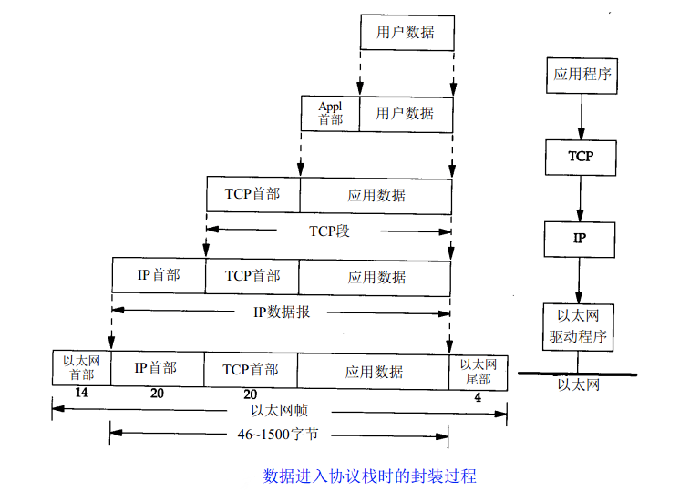
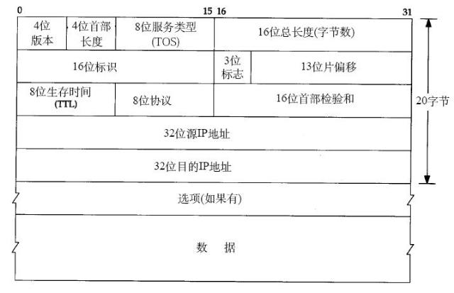
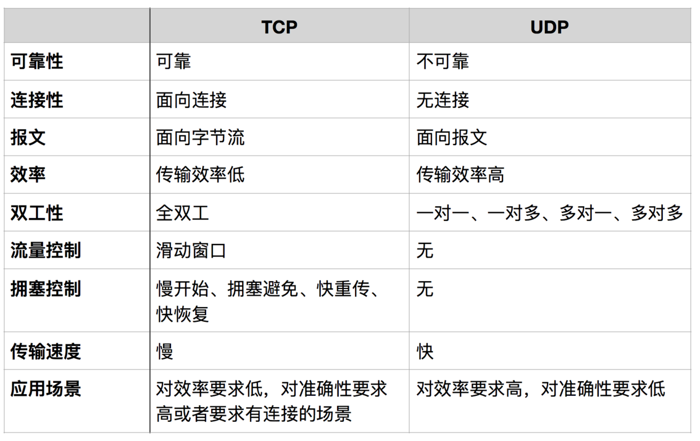
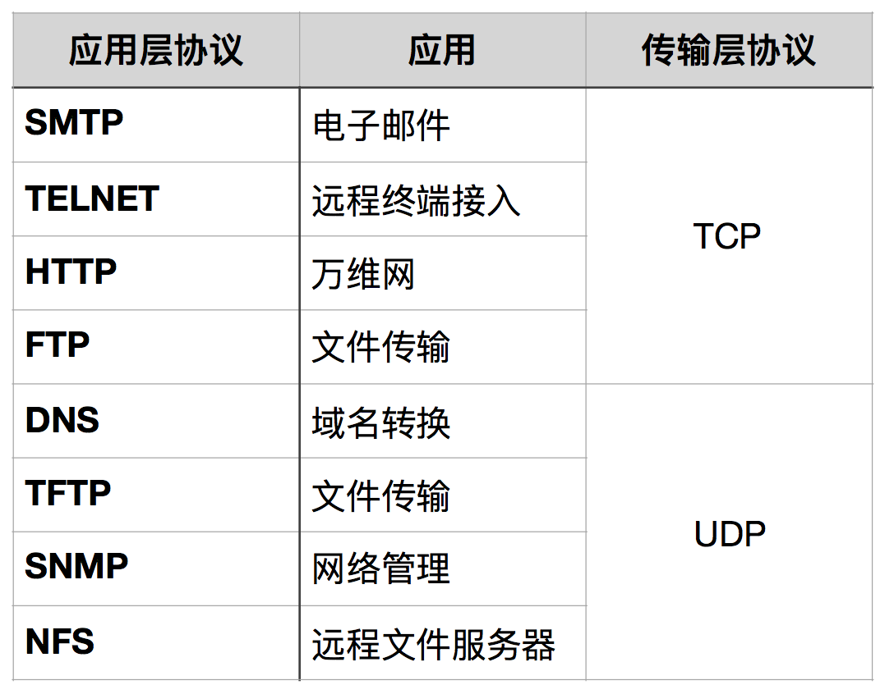
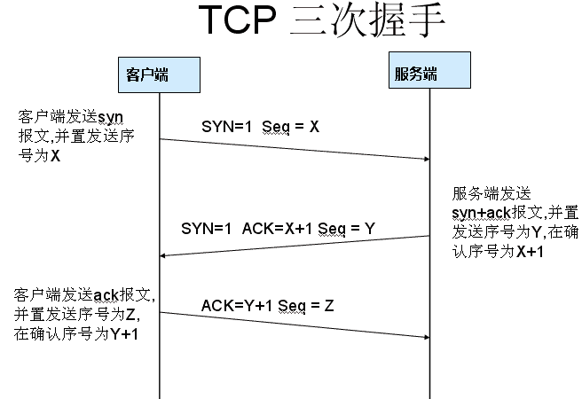
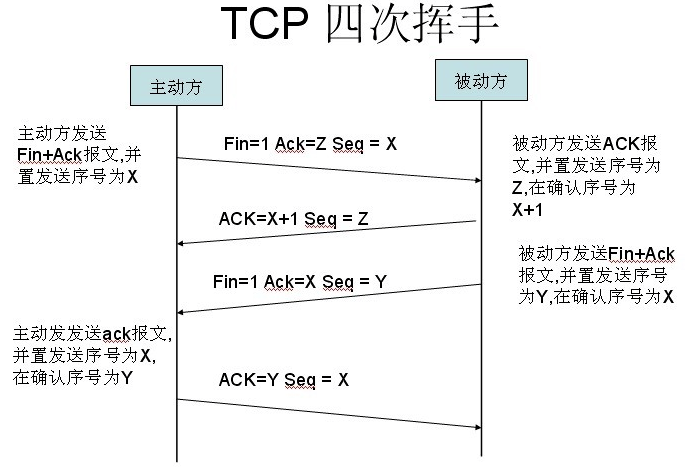

# 1. 网络体系结构：  

```
OSI七层体系结构：		TCP/IP四层体系结构：		五层协议体系结构：

应用层			应用层				应用层
表示层				
会话层
运输层			运输层				运输层
网络层			网际层				网络层
数据链路层			网络接口层				数据链路层
物理层							物理层
```



# 2. 物理层
发送端，传送端，接收端
模拟调制，数字调制，基带信号，带通信号，调幅(AM),调频(FM),调相(PM)。
信道容量，信噪比，码间串扰
频分复用，时分复用(同步，异步)，波分复用，码分复用，码分多址(CDMA)

# 3.数据链路层

网络层：分组从一个网络经路由器转发到另一个网络
数据链路层：同一局域网中，分组从一个主机不经路由器到达另一个主机

点对点信道：ppp协议
广播信道：CSMA\CD协议

## 3.1 点对点信道
### 3.11数据链路和帧
网络适配器:数据链路层和物理层功能

网络层的分组(IP数据报)封装成帧
帧中传送的是ASCII码表示的文本文件时，SOH,EOT的帧定界符----->透明传输
帧中传输的是非ASCII码表示的文本文件时(二进制的计算机程序或图像等)

差错检测：冗余检验，CRC检测--------->无比特差错，可能会出现帧丢失，帧重复，帧失序差错

通信质量好的有线网络：不使用确认和重传机制，由上层协议修改错误
通信质量差的无线网络：使用确认和重传机制

## 3.2 ppp协议

## 3.3 广播信道数据链路层
局域网使用广播信道：涉及数据链路层和物理层

以太网成为局域网代名词，MAC子层，以太网使用CSMA/CD协议，以太网中使用集线器或总线连接主机
### 3.4.3
MAC层硬件地址:
网卡过滤功能
以太网扩展：
	在物理层，
	在数据链路层：使用网桥扩展（连接两个网段，网桥的每个端口与一个网段相连）

# 4. 网络层
网络层向上层提供简单灵活的、无连接的、尽最大努力交付的数据报服务

将网络连接起来要用一些中间设备:
物理层：转发器、集线器
数据链路层：网桥
网络层：路由器
网络层以上：网关

## 4.1 IP 协议
 
IP协议是TCP/IP协议的核心，所有的TCP，UDP，IMCP，IGMP的数据都以IP数据格式传输。要注意的是，IP不是可靠的协议，这是说，
IP协议没有提供一种数据未传达以后的处理机制，这被认为是上层协议：TCP或UDP要做的事情。

### 4.1.1 IP 协议头


八位的TTL字段。这个字段规定该数据包在穿过多少个路由之后才会被抛弃。某个IP数据包每穿过一个路由器，该数据包的TTL数值就会减少1，
当该数据包的TTL成为零，它就会被自动抛弃。这个字段的最大值也就是255，也就是说一个协议包也就在路由器里面穿行255次就会被抛弃了，根据系统的不同，
这个数字也不一样，一般是32或者是64。

## 4.2 ARP 协议
ARP 是根据IP地址获取MAC地址的一种协议。
ARP（地址解析）协议是一种解析协议，本来主机是完全不知道这个IP对应的是哪个主机的哪个接口，当主机要发送一个IP包的时候，
会首先查一下自己的ARP高速缓存（就是一个IP-MAC地址对应表缓存）。如果查询的IP－MAC值对不存在，那么主机就向网络发送一个ARP协议广播包，
这个广播包里面就有待查询的IP地址，而直接收到这份广播的包的所有主机都会查询自己的IP地址，如果收到广播包的某一个主机发现自己符合条件，
那么就准备好一个包含自己的MAC地址的ARP包传送给发送ARP广播的主机。而广播主机拿到ARP包后会更新自己的ARP缓存（就是存放IP-MAC对应表的地方）。
发送广播的主机就会用新的ARP缓存数据准备好数据链路层的的数据包发送工作。
RARP协议的工作与此相反，不做赘述。
## 4.3 ICMP 协议
IP协议并不是一个可靠的协议，它不保证数据被送达，那么，自然的，保证数据送达的工作应该由其他的模块来完成。其中一个重要的模块就是ICMP(网络控制报文)协议。
ICMP不是高层协议，而是IP层的协议。当传送IP数据包发生错误。比如主机不可达，路由不可达等等，ICMP协议将会把错误信息封包，然后传送回给主机。
给主机一个处理错误的机会，这 也就是为什么说建立在IP层以上的协议是可能做到安全的原因。

## 4.4. IP地址的分类：

同一个局域网上的主机或路由器的IP地址中的网络号必须一样

同一个子网内的主机是同一个网段

IP地址：

0.0.0.0      ----------  0.255.255.255    保留地址，用于表示所有IP地址
1.0.0.0      ----------  126.255.555.555  A类地址
128.0.0.1    ----------  191.255.255.255  B类地址
192.0.0.1    ----------  223.255.255.255  C类地址
127.0.0.0    ----------  127.255.255.255  保留地址，用于循环测试

A类地址：1.0.0.0 ----------  126.255.555.555

默认网络屏蔽为：255.0.0.0
第1字节表示网络本身地址，后三个地址表示连接于网络的主机，分配给拥有大量主机的大型网络
internet 中A类网络有126个，每个A类网络可连接 [(255*255*255)-2]台主机(-2是因为主机中要用
去一个网络号和一个广播号)
A类地址最高位必须是0，即第1字节范围为0---127
A类地址中的私有地址和保留地址： 
① 10.X.X.X是私有地址（所谓的私有地址就是在互联网上不使用，而被用在局域网络中的地址）。 
② 127.X.X.X是保留地址，用做循环测试用的。


B类地址：128.0.0.1 --------  191.255.255.255

默认网络屏蔽为：255.255.0.0
B类地址用于中性网络，用第1，2字节表示网络地址，后两组数字表示主机地址
169.254.0.0 ---- 169.254.255.255 是保留地址，若IP地址设为自动获取，而在网络中又没有
找到可用的DHCP服务器，这时将会从169.254.0.0 ---- 169.254.255.255中临时获得一个IP地址
B类地址最高位必须是10，即第1字节范围是128---191
每个B类地址可连接[2^16 -2]台主机(因为主机号的各位不能同时为0或1)
internet 中有[2^14 -1]B类地址(128.0.0.0不指派)
B类地址的私有地址和保留地址 
① 172.16.0.0—172.31.255.255是私有地址 
② 169.254.X.X是保留地址。如果你的IP地址是自动获取IP地址，而你在网络上又没有找到
可用的DHCP服务器。就会得到其中一个IP。


C类地址：192.0.0.1 -------- 223.255.255.255
默认网络屏蔽为：255.255.255.0
C类网络分配给局域网，前3字节表示网络地址，最后一组数字表示主机地址
C类网络最高位为110，即范围192--223，每个C网络可连接254台主机
internet 中有(32*256*256)个C网络，有(32*256*256*254)个地址
C类地址中的私有地址: 192.168.X.X是私有地址。


D类地址：224.0.0.0 --------  239.255.255.254

D类地址不分网络地址和主机地址，用于多点播送，称为广播地址


E类地址保留给将来使用


特殊的IP地址：
1.广播地址目的端为给定网络上的所有主机
2.单播地址目的端为指定网络上的单个主机
3.组播地址目的端为同一组内的所有主机地址
4.环回地址127.0.0.1 在换回测试和广播测试时会使用


RFC 1918留出了3块IP地址空间(1块A,16个B,256个C)作为私有的内部使用的地址，该范围的IP地址不能
被路由到Internet骨干网，Internet路由器将丢弃该私有地址：
IP地址类别                 RFC 1918内部地址范围
A类                        10.0.0.0    ---  10.255.255.255
B类                        172.16.0.0  ---  172.31.255.255
C类                        192.168.0.0 ---  192.168.255.255


IP地址分为五类，A类保留给政府机构，B类分配给中等规模的公司，C类分配给任何需要的人，
D类用于组播，E类用于实验，各类可容纳的地址数目不同。


路由器发生在网络层，交换机发生在数据链路层

一般路由器具有防火墙功能，互联网用户只能访问到路由器WAN口，访问不到内部服务器。
想要让外部用户访问到局域网内的服务器，就需要在路由器上做一个端口映射设置


## 5 传输层
### 5.1 TCP/UDP 协议
TCP/UDP都是是传输层协议，但是两者具有不同的特性，同时也具有不同的应用场景，下面以图表的形式对比分析。



- 面向报文  
面向报文的传输方式是应用层交给UDP多长的报文，UDP就照样发送，即一次发送一个报文。因此，应用程序必须选择合适大小的报文。
若报文太长，则IP层需要分片，降低效率。若太短，会是IP太小。
- 面向字节流  
面向字节流的话，虽然应用程序和TCP的交互是一次一个数据块（大小不等），但TCP把应用程序看成是一连串的无结构的字节流。
TCP有一个缓冲，当应用程序传送的数据块太长，TCP就可以把它划分短一些再传送。
- TCP/UDP应用  


### 5.2 DNS
DNS（Domain Name System，域名系统），因特网上作为域名和IP地址相互映射的一个分布式数据库，能够使用户更方便的访问互联网，
而不用去记住能够被机器直接读取的IP数串。通过主机名，最终得到该主机名对应的IP地址的过程叫做域名解析（或主机名解析）。
DNS协议运行在UDP协议之上，使用端口号53。

### 5.3 TCP 连接的建立和终止
- 三次握手  
TCP是面向连接的，无论哪一方向另一方发送数据之前，都必须先在双方之间建立一条连接。在TCP/IP协议中，TCP协议提供可靠的连接服务，
连接是通过三次握手进行初始化的。三次握手的目的是同步连接双方的序列号和确认号并交换 TCP窗口大小信息 



第一次握手： 建立连接。  
客户端发送连接请求报文段，将SYN位置为1，Sequence Number为x；然后，客户端进入SYN_SEND状态，等待服务器的确认；    
第二次握手： 服务器收到SYN报文段。  
服务器收到客户端的SYN报文段，需要对这个SYN报文段进行确认，设置Acknowledgment Number为x+1(Sequence Number+1)；
同时，自己自己还要发送SYN请求信息，将SYN位置为1，Sequence Number为y；服务器端将上述所有信息放到一个报文段（即SYN+ACK报文段）中，
一并发送给客户端，此时服务器进入SYN_RECV状态；  
第三次握手：   
客户端收到服务器的SYN+ACK报文段。然后将Acknowledgment Number设置为y+1，向服务器发送ACK报文段，这个报文段发送完毕以后，
客户端和服务器端都进入ESTABLISHED状态，完成TCP三次握手。  
- 为什么要三次握手？  
为了防止已失效的连接请求报文段突然又传送到了服务端，因而产生错误。
具体例子：“已失效的连接请求报文段”的产生在这样一种情况下：client发出的第一个连接请求报文段并没有丢失，而是在某个网络结点长时间的滞留了，
以致延误到连接释放以后的某个时间才到达server。本来这是一个早已失效的报文段。但server收到此失效的连接请求报文段后，就误认为是client再次发出的一个新的连接请求。
于是就向client发出确认报文段，同意建立连接。假设不采用“三次握手”，那么只要server发出确认，新的连接就建立了。由于现在client并没有发出建立连接的请求，
因此不会理睬server的确认，也不会向server发送数据。但server却以为新的运输连接已经建立，并一直等待client发来数据。这样，server的很多资源就白白浪费掉了。
采用“三次握手”的办法可以防止上述现象发生。例如刚才那种情况，client不会向server的确认发出确认。server由于收不到确认，就知道client并没有要求建立连接。

- 四次挥手  
当客户端和服务器通过三次握手建立了TCP连接以后，当数据传送完毕，肯定是要断开TCP连接的啊。那对于TCP的断开连接，这里就有了神秘的“四次分手”。


第一次分手：   
主机1（可以使客户端，也可以是服务器端），设置Sequence Number，向主机2发送一个FIN报文段；此时，主机1进入FIN_WAIT_1状态；
这表示主机1没有数据要发送给主机2了；
第二次分手：   
主机2收到了主机1发送的FIN报文段，向主机1回一个ACK报文段，Acknowledgment Number为Sequence Number加1；
主机1进入FIN_WAIT_2状态；主机2告诉主机1，我“同意”你的关闭请求；
第三次分手：   
主机2向主机1发送FIN报文段，请求关闭连接，同时主机2进入LAST_ACK状态；
第四次分手：   
主机1收到主机2发送的FIN报文段，向主机2发送ACK报文段，然后主机1进入TIME_WAIT状态；主机2收到主机1的ACK报文段以后，就关闭连接；
此时，主机1等待2MSL后依然没有收到回复，则证明Server端已正常关闭，那好，主机1也可以关闭连接了。

- 为什么要四次分手？  
TCP协议是一种面向连接的、可靠的、基于字节流的运输层通信协议。TCP是全双工模式，这就意味着，当主机1发出FIN报文段时，只是表示主机1已经没有数据要发送了，
主机1告诉主机2，它的数据已经全部发送完毕了；但是，这个时候主机1还是可以接受来自主机2的数据；当主机2返回ACK报文段时，表示它已经知道主机1没有数据发送了，
但是主机2还是可以发送数据到主机1的；当主机2也发送了FIN报文段时，这个时候就表示主机2也没有数据要发送了，就会告诉主机1，我也没有数据要发送了，
之后彼此就会愉快的中断这次TCP连接。
- 为什么要等待2MSL？  
MSL：报文段最大生存时间，它是任何报文段被丢弃前在网络内的最长时间。原因有二：

1. 保证TCP协议的全双工连接能够可靠关闭
2. 保证这次连接的重复数据段从网络中消失

第一点：如果主机1直接CLOSED了，那么由于IP协议的不可靠性或者是其它网络原因，导致主机2没有收到主机1最后回复的ACK。
那么主机2就会在超时之后继续发送FIN，此时由于主机1已经CLOSED了，就找不到与重发的FIN对应的连接。所以，主机1不是直接进入CLOSED，
而是要保持TIME_WAIT，当再次收到FIN的时候，能够保证对方收到ACK，最后正确的关闭连接。
第二点：如果主机1直接CLOSED，然后又再向主机2发起一个新连接，我们不能保证这个新连接与刚关闭的连接的端口号是不同的。
也就是说有可能新连接和老连接的端口号是相同的。一般来说不会发生什么问题，但是还是有特殊情况出现：假设新连接和已经关闭的老连接端口号是一样的，
如果前一次连接的某些数据仍然滞留在网络中，这些延迟数据在建立新连接之后才到达主机2，由于新连接和老连接的端口号是一样的，
TCP协议就认为那个延迟的数据是属于新连接的，这样就和真正的新连接的数据包发生混淆了。所以TCP连接还要在TIME_WAIT状态等待2倍MSL，
这样可以保证本次连接的所有数据都从网络中消失。