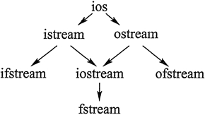

# 1. C语言
## 1.1 创建/打开
```
1. open
#include <sys/types.h>
#include <sys/stat.h>
#include <fcntl.h>
int open(const char* pathname, int flags);
int open(const char* pathname, int flags, mode_t mode)

flags:指定打开/创建模式，可由fcntl.h 中常量指定：
O_RDONLY:只读模式
O_WRONLY:只写模式
O_RDWR:读写模式
----------------------------------
O_APPEND:每次操作都写到文件尾（追加）
O_CREAT:若指定文件不存在则创建这个文件
O_EXCL:如果要创建的文件已存在，则返回 -1，并且修改 errno 的值
O_TRUNC:如果文件存在，并且以只写/读写方式打开，则清空文件全部内容
O_NOCTTY:如果路径名指向终端设备，不要把这个设备用作控制终端
O_NONBLOCK:	如果路径名指向 FIFO/块文件/字符文件，则把文件的打开和后继 I/O设置为非阻塞模式（nonblocking mode）
----------------------------------
O_DSYNC:等待物理 I/O 结束后再 write。在不影响读取新写入的数据的前提下，不等待文件属性更新
O_RSYNC:read 等待所有写入同一区域的写操作完成后再进行
O_SYNC:等待物理 I/O 结束后再 write，包括更新文件属性的 I/O

使用O_CREAT的时候，必须指定mode 参数，定义在sys/stat.h
S_IFMT       0xF000    文件类型掩码   
S_IFDIR      0x4000    目录                        
S_IFIFO      0x1000    FIFO 专用                   
S_IFCHR      0x2000    字符专用                    
S_IFBLK      0x3000    块专用                      
S_IFREG      0x8000    只为0x0000                  
S_IREAD      0x0100    可读                        
S_IWRITE     0x0080    可写                        
S_IEXEC      0x0040    可执行

返回值是int 型的文件描述符，打开失败返回-1

2 fopen
#include <stdio.h>
FILE *fopen(const char *path, const char *mode);

mode：文件打开模式
"r":只读方式打开（文件必须存在）
"r+":读写方式打开（文件必须存在）
"w":只写方式打开（文件存在则清空内容，不存在则创建）
"w+":读写方式打开（文件存在则清空内容，不存在则创建）
"a":只写追加方式打开（文件存在，数据写到文件尾，不存在则创建）
"a+":可读写追加方式打开（文件存在，数据写到文件尾，不存在则创建）
------------------------------------
"rb":只读方式打开二进制文件（同"r"）
"rb+":读写方式打开二进制文件（同"r+"）
"wb":只写方式打开二进制文件（同"w"）
"wb+":读写方式打开二进制文件（同"w+"）
"ab":只写追加方式打开二进制文件（同"a"）
"ab+":读写追加方式打开二进制文件（同"a+"）

返回值是FILE 类型指针，打开失败返回NULL

-----------------------------------
二者区别：
open 属于低级IO（系统级别，属于系统调用）,fopen属于高级IO（C库函数）
open 返回文件描述符，fopen返回文件指针
open 没有缓冲，fopen 有缓冲
open 与 read,write等配合使用，fopen 与 fread,fwrite 等配合使用

```
## 1.2 读写
```
1. 字符形式
int fgetc(FILE* fp);
int getc(FILE* fp)
int getchar(void);

getc 与 fgetc 用法相同，getchar 从stdin 获取输入
return:返回读到的字符，结束时和读取错误时返回EOF
-------------------------------------
int fputc(int ch, FILE* fp);
int putc(int ch, FILE* fp);
int putchar(int ch);

fputc == putc, putchar 输出到stdout

2. 字符串形式
char* fgets(char* str, int count,FILE* fp)
从 fp 读取 count-1 个字符，当遇到换行和结束符EOF时停止，并在最后读取的字符后自动填充'\0';
return:str,当文件尾和读取error时返回NULL

char* gets(char* str);
从 stdin 读取一行字符串,遇到换行停止
return: str, 文件尾和读取错误返回NULL
-------------------------------------
int fputs(char* str, FILE* fp);
向fp 写入 str
return：成功返回非负数，失败返回EOF

puts(char* str);
向stdout 输出str
return：成功返回非负数，失败返回EOF

3. 块形式
size_t fread(void* ptr, size_t size, size_t count, FILE* fp);
size_t fwrite(void* ptr, size_t size, size_t count, FILE* fp);

ptr:表示内存区块指针
size:每个数据块的大小
count:读写数据块的块数
fp:文件指针

return:返回成功读写的块数，若小于count:
    fwrite,写入错误，可用ferror() 检测
    fread,读到了文件尾，或错误，可用feof(),ferror()检测
------------------------------------

#include <unistd.h>
size_t read(int fd, void* buff, size_t size);
size_t write(int fd, void* buff, size_t size);

4. 格式化读写
int fscanf(FILE* fp, char* format, ...);
int fprintf(FILE* fp, char* format, ...);
    
5. 随机读写
void rewind(FILE* fp);
将位置指针移到文件头
int fseek(FILE* fp, long offset, int origin);
offset:偏移量，为正时向后移动，为负时向前移动
origin:起始位置，有三种：
文件开头：SEEK_SET  0
当前位置：SEEK_CUR  1
文件末尾：SEEK_END  2

```

# 2 C++
C++ 标准类库中有三个类可以用于文件操作，它们统称为文件流类。这三个类是：
ifstream：用于从文件中读取数据。
ofstream：用于向文件中写人数据。
fstream：既可用于从文件中读取数据，又可用于 向文件中写人数据。  
使用这三个类时，程序中需要包含 fstream 头文件。 C++ 类库中的流类如下图所示。  



## 2.1 创建
打开文件可以通过以下两种方式进行：  
调用流对象的 open 成员函数打开文件。
定义文件流对象时，通过构造函数打开文件。  
关闭文件时，调用文件流对象的 close 成员函数即可。

void open(const char* szFileName, int mode);  
szFileName:文件名  
mode:打开模式

模式标记 | 适用对象 | 作用
---|--- | ---
ios::in | ifstream,fstream | 只读方式打开，文件不存在则出错
ios::out | ostream,fstream | 只写方式打开，文件存在，覆盖原来内容，文件不存在则创建
ios::app | ostream,fstream | 写方式打开，在尾部追加数据，文件不存在则创建
ios::ate | ifstream | 打开已有文件，并将文件读指针指向文件尾，若文件不存在则出错
ios::trunc | ofstream | 单独使用与ios::out相同
ios::binary | ifstream,ofstream,fstream| 以二进制方式打开文件，不指定此模式默认文本方式
ios::in\|ios::out | fstream | 打开已存在文件，可读写，文件打开内容不会删除，文件不存在则出错
ios::in\|ios::out\|ios::trunc | fstream | 读写方式打开文件，打开时清除文件内容，文件不存在则创建

```
1. 成员函数 open
#include <iostream>
#include <fstream>
using namespace std;

int main(int argc, char** argv)
{
    ifstream infile;
    infile.open("file", ios::in);
    if(infile) // 条件成立，打开成功
        infile.close();
        
    ofstream outfile;
    outfile.open("file", ios::out);
    if(!outfile) // 条件成立，文件打开失败
        cout << "error" << endl;
        
    fstream iofile;
    iofile.open("file", ios::in|ios::out|ios::trunc);
    if(iofile)
        iofile.close();
}

2. 使用类构造函数打开文件
定义流对象时，其构造函数可以打开文件
ifstream:
ifstream::ifstream(const char* szFileName, int mode=ios::in, int);
szFileName:文件名
mode:,模式，默认ios::in
第三个参数整形，有默认值

#include <iostream>
#include <fstream>
using namespace std;

int main(int argc, char** argv)
{
    ifstream infile("file", ios::in);
    if(!infile.open())
        cout << "文件打开失败" << endl;
    
    ostream outfile("file", ios::out);
    if(outfile)
        outfile.close();
        
    fstream iofile("file", ios::in|ios::out);
    if(iofile)
        iofile.close();
}

bool is_open(); //文件是否成功打开
```
## 2.2 读写
文本方式：
```
#include <iostream>
#include <fstream>
using namespace std;

int main(int argc, char** argv)
{
    int data[100];
    for(int i=0; i<100; ++i) {
        data[i] = i;
    }
    
    ofstream outfile("file", ios::out);
    if(!outfile)
        return -1;
        
    for(int i=0; i< 100; ++i) {
        outfile << a[i] << " "
    }
    return 0;
}
```
二进制方式：  
```
istream& read(char* buff, int count);  
ostream& write(char* buff, int count);

想知道实际读取多少字节，使用成员函数
int getcount();
其返回值是最近一次read函数读取的字节
-------------------------------------------
使用get,put 读写一个字节
#include <fstream>
int get();
istream& get( char& ch );
istream& get( char* buffer, streamsize num );
istream& get( char* buffer, streamsize num, char delim );
istream& get( streambuf& buffer );
istream& get( streambuf& buffer, char delim );
 
The get() function is used with input streams, and either:
* reads a character and returns that value, 
* reads a character and stores it as ch, 
* reads characters into buffer until num - 1 * characters have been read, or EOF or newline encountered, 
* reads characters into buffer until num - 1 characters have been read, or EOF or the delim character encountered (delim is not read until next time), 
* reads characters into buffer until a newline or EOF is encountered, 
* or reads characters into buffer until a newline, EOF, or delim character is encountered (again, delim isn't read until the next get() ). 

```
## 2.3 随机读写
```
ofstream 和 fstream 类有seekp 成员函数，可以设置文件写指针位置  
ifstream 和 fstream 类有seekg 成员函数，可以设置文件读指针位置   
istream& seekg(int offset, int mode);  
ostream& seekp(int offset, int mode);
mode:文件读写指针设置模式：
ios::beg:文件读写指针从文件开始位置向后偏移offset字节，offset只能是非负数  
ios::cur:文件指针从当前位置移动offset字节，正数表示向后移动，负数相反  
ios::end:文件指针从文件尾向前移动offset字节，offset<= 0.  
--------------------------------------------
成员函数 teelg, teelp 获取文件读写指针位置
int tellg();
int tellp();
```
## 2.4 状态标识符验证
```
bool eof(); // 是否达到文件尾
bool bad(); // 读写过程是否出错
bool fail();    // 除了与bad同样情况会返回true外，格式错误也会返回true
bool good();    // 最通用的,如果调用以上任何一个函数返回true的话，此函数会返回false

```
## 2.5 缓存和同步

当我们对文件流进行操作的时候，它们与一个streambuf 类型的缓存(buffer)联系在一起。这个缓存（buffer）实际是一块内存空间，作为流(stream)和物理文件的媒介。例如，对于一个输出流， 每次成员函数put (写一个单个字符)被调用，这个字符不是直接被写入该输出流所对应的物理文件中的，而是首先被插入到该流的缓存（buffer）中。

当缓存被排放出来(flush)时，它里面的所有数据或者被写入物理媒质中（如果是一个输出流的话），或者简单的被抹掉(如果是一个输入流的话)。这个过程称为同步(synchronization)，它会在以下任一情况下发生：  
- 当文件被关闭时:在文件被关闭之前，所有还没有被完全写出或读取的缓存都将被同步。  
- 当缓存buffer 满时:缓存Buffers有一定的空间限制。当缓存满时，它会被自动同步。  
- 控制符明确指明:当遇到流中某些特定的控制符时，同步会发生。这些控制符包括：flush 和endl。
- 明确调用函数sync(): 调用成员函数sync() (无参数)可以引发立即同步。这个函数返回一个int 值，等于-1 表示流没有联系的缓存或操作失败。
