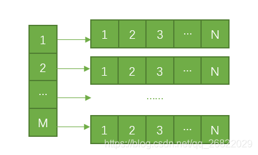

# 1 可变参函数
eg:
```
int ptintf(const char* format, ...);
可变参函数至少有一个固定参数，"..." 表示函数之后有若干参数

c 中提供以下函数解析可变参数：

typedef char* va_list
void va_start(va_list ap, last);
type va_arg(va_list ap, type);
void va_end(va_list ap);
void va_copy(va_list dest, va_list src);

在 VC 中 定义以下宏：
typedef char* va_list
#define _INTSIZEOF(n)   (sizeof(n)+sizeof(int)-1) &~ (sizeof(int)-1) //int 字节对齐
#define va_start(ap, v) (ap = (va_list)&v+_INTSIZEOF(v)) //第一个可变参数
#define va_arg(ap, t)   (*(t*)(ap+= _INTSIZEOF(t) - _INTSIZEOF(t))) // 获取可变参数
#define va_end(ap)  (ap=(va_list)0)
```
在大多编译器中，参数入栈是从右到左的，因此参数入栈后内存模型如下：  
|---------------------------|  
|最后一个可变参数|                -> 高内存地址  
|---------------------------|  
|第N个可变参数|                  ->var_arg()  
|---------------------------|  
|第一个可变参数|                ->va_start()  
|---------------------------|  
|第一个固定参数|                   -> 低内存地址

# 二维数组
int arry[m][n];



数组指针  
int (*p)[n],表示指向长度为n的整形数组的指针，(p+1)时需要跨越n个整形数组长度  
