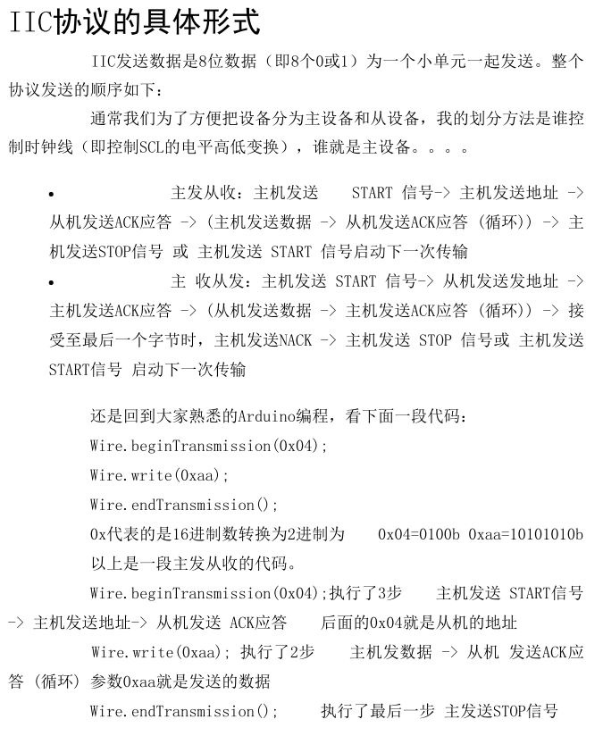
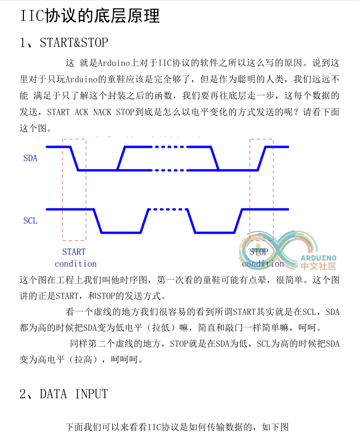
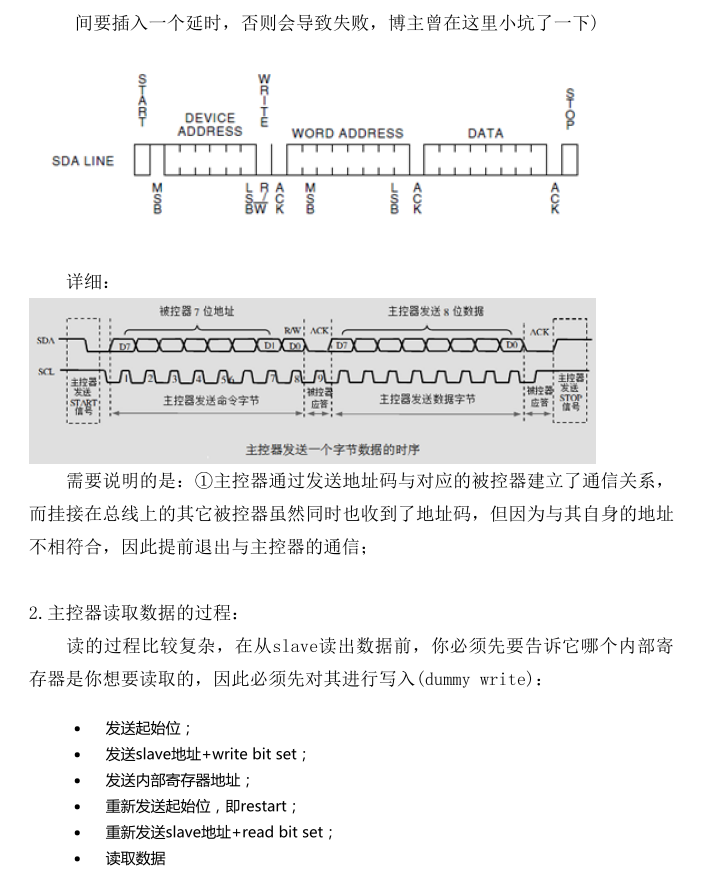
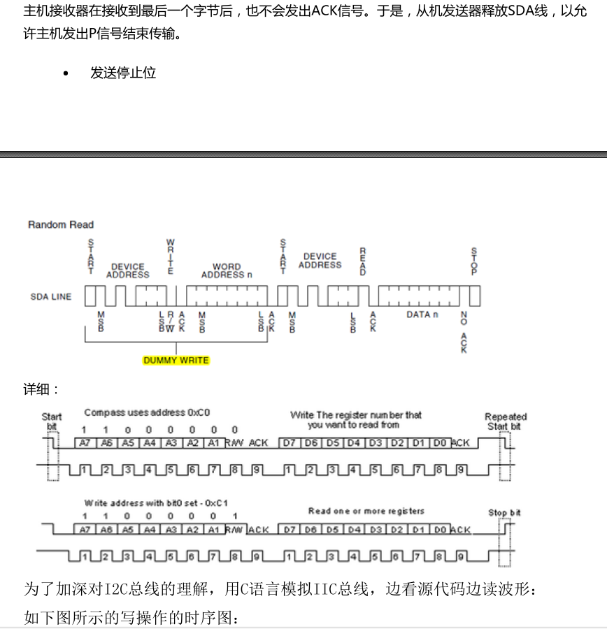

```
这种总线类型是由飞利浦半导体公司在八十年代初设计出来的，主要是用来连接整体电路，IIC是一种多向控制总线，也就是说多个芯片可以连接
在一起，同时每个 芯片都可以对其他的芯片进行数据传输。这种方式简化了信号传输总线。但是这种方式也增加了一个传送数据的步骤，就是需要对信号线上
的每个芯片定义一个逻辑 地址，让芯片知道这个信息是发给他的（类似电话号码的功能），这个之后再说。
IIC协议包含START（类似于第一下敲门）、ACK（里面的人给予回应）、NACK（另一种回答）、STOP（表示数据发送结束）
这几个东西，当然还少不了普通的数据发送。尽管协议中规定START必须，其他几个非必须，但实际上其他三个仍旧非常重要。
```











```
#include<reg51.h>

#define uchar unsigned char
#define uint unsigned int
#define write_ADD 0xa0
#define read_ADD 0xa1

uchar a;  
sbit SDA=P2^0;
sbit SCL=P2^1;
void SomeNop();     //短延时
void init();    //初始化
void check_ACK(void)；
void I2CStart(void);
void I2cStop(void);
void write_byte(uchar dat);//写字节
void delay(uint z);
uchar read_byte();     //读字节
void write(uchar addr,uchar dat);  //指定地址写
uchar read(uchar addr);       //指定地址读
bit flag;  //应答标志位

void main()
{
    init();
    write_add(5,0xaa); //向地址5写入0xaa
    delay(10);      //延时,否则被坑呀！！！
    P1=read_add(5);      //读取地址5的值
    while(1);    
}

//***************************************************************************  
void delay()//简单延时函数  
{ ;; }  
//***************************************************************************

void start()  //开始信号 SCL在高电平期间，SDA一个下降沿则表示启动信号  
{     
    sda=1; //释放SDA总线  
    delay();  
    scl=1;  
    delay();  
    sda=0;  
    delay();  
}

//***************************************************************************  
void stop()   //停止 SCL在高电平期间，SDA一个上升沿则表示停止信号  
{  
    sda=0;  
    delay();  
    scl=1;  
    delay();  
    sda=1;  
    delay();  
}
//***************************************************************************  
void respons()  //应答 SCL在高电平期间，SDA被从设备拉为低电平表示应答  
{  
    uchar i;  
    scl=1;  
    delay();
    //至多等待250个CPU时钟周期
    while((sda==1)&&(i<250))i++;  
    scl=0;  
    delay();  
}  
//***************************************************************************  
void init()//总线初始化 将总线都拉高一释放总线  发送启动信号前，要先初始化总线。即总有检
测到总线空闲才开始发送启动信号  
{  
    sda=1;  
    delay();  
    scl=1;  
    delay();  
}  
//***************************************************************************  
void write_byte(uchar date) //写一个字节  
{  
    uchar i,temp;  
    temp=date;  
    for(i=0;i<8;i++)  
    {          temp=temp<<1;  
        scl=0;//拉低SCL，因为只有在时钟信号为低电平期间按数据线上的高低电平状态才允许变
化；并在此时和上一个循环的scl=1一起形成一个上升沿  
        delay();  
        sda=CY;  
        delay();  
        scl=1;//拉高SCL，此时SDA上的数据稳定  
        delay();  
    }  
    scl=0;//拉低SCL，为下次数据传输做好准备  
    delay();  
    sda=1;//释放SDA总线，接下来由从设备控制，比如从设备接收完数据后，在SCL为高时，拉低
SDA作为应答信号  
    delay();  
}  
//***************************************************************************  
uchar read_byte()//读一个字节  
{  
    uchar i,k;  
    scl=0;  
    delay();  
    sda=1;  
    delay();  
    for(i=0;i<8;i++)  
    {  
        scl=1;//上升沿时，IIC设备将数据放在sda线上，并在高电平期间数据已经稳定，可以接收啦  
        delay();      
        k=(k<<1)|sda;  
        scl=0;//拉低SCL，使发送端可以把数据放在SDA上  
        delay();      
    }  
    return k;  
}  
//***************************************************************************  
void write_add(uchar address,uchar date)//任意地址写一个字节  
{  
    start();//启动  
    write_byte(0xa0);//发送从设备地址      respons();//等待从设备的响应  
    write_byte(address);//发出芯片内地址  
    respons();//等待从设备的响应  
    write_byte(date);//发送数据  
    respons();//等待从设备的响应  
    stop();//停止  
}  
//***************************************************************************  
uchar read_add(uchar address)//读取一个字节  
{  
    uchar date;  
    start();//启动  
    write_byte(0xa0);//发送发送从设备地址 写操作  
    respons();//等待从设备的响应  
    write_byte(address);//发送芯片内地址  
    respons();//等待从设备的响应  
    start();//启动  
    write_byte(0xa1);//发送发送从设备地址 读操作  
    respons();//等待从设备的响应  
    date=read_byte();//获取数据  
    stop();//停止  
    return date;//返回数据  
}
```